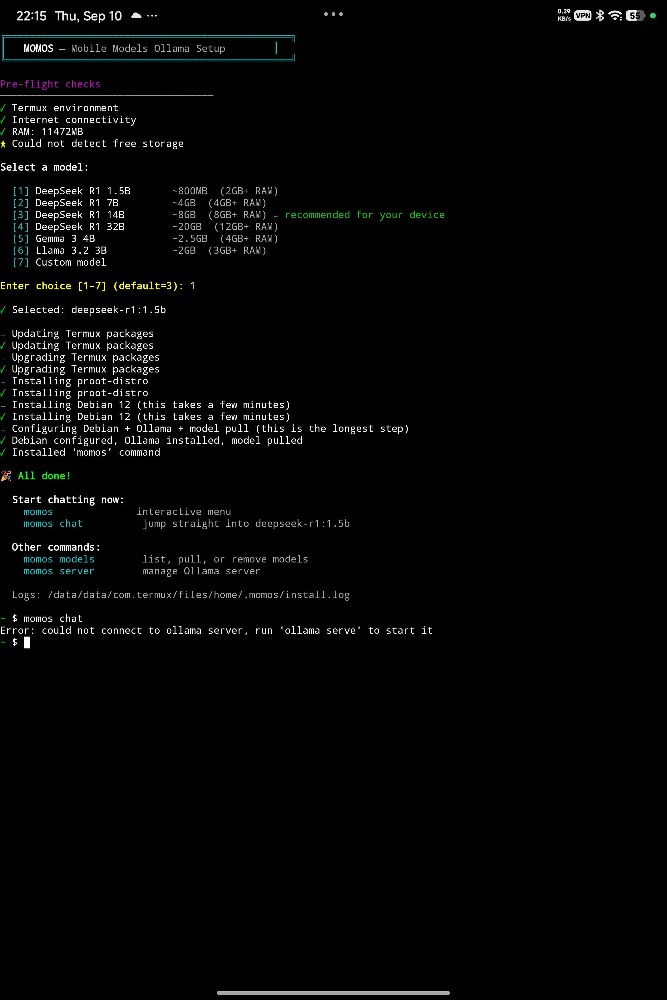
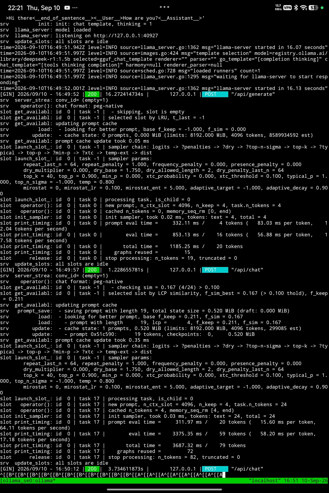

# MOMOS — Mobile Models Ollama Setup

[](LICENSE)
[](https://termux.dev)
[](#how-it-works)
[](#requirements)
[](#how-it-works)

Run lightweight AI models locally on your Android phone using Termux and Ollama. One command to install, no root needed, runs completely offline.



## What it does

- Checks your phone's RAM and storage
- Sets up a Debian container in Termux via PRoot (no root needed)
- Installs Ollama and downloads a model tailored to your device
- Adds a simple `momos` command to chat and manage models

---

## Quick Install

Open **[Termux](https://f-droid.org/packages/com.termux/)** and run:

```bash
curl -fsSL https://raw.githubusercontent.com/Sidharth-e/MOMOS/main/scripts/momos.sh -o /tmp/momos.sh && bash /tmp/momos.sh
```

The installer will test your hardware, recommend a model, set up the environment, and drop you straight into chat.

---

## Supported Models (<7B)

Larger models (14B, 32B) require too much memory and quickly crash or throttle on phones. MOMOS focuses on models under 7B parameters that fit within typical smartphone RAM limits (2GB to 8GB+):

| Model | Tag | Download | RAM Needed | Best For |
|---|---|---|---|---|
| **Llama 3.2 1B** | `llama3.2:1b` | ~1.3 GB | 2 GB+ | Fast responses, low battery use, low-end phones |
| **DeepSeek R1 1.5B** | `deepseek-r1:1.5b` | ~1.1 GB | 2 GB+ | Step-by-step reasoning and logic |
| **Llama 3.2 3B** | `llama3.2:3b` | ~2.0 GB | 4 GB+ | Everyday chat, writing, and summarization |
| **Qwen 2.5 3B** | `qwen2.5:3b` | ~1.9 GB | 4 GB+ | Math, coding, and multilingual queries |
| **DeepSeek R1 7B** | `deepseek-r1:7b` | ~4.7 GB | 6–8 GB+ | Advanced reasoning on higher-RAM devices |
| **Qwen 2.5 7B** | `qwen2.5:7b` | ~4.7 GB | 6–8 GB+ | Detailed coding and technical answers |

You can also use any model tag from the [Ollama library](https://ollama.com/library) (e.g. `phi4-mini`, `smollm2:1.7b`).

---

## Usage

### Interactive Menu
```bash
momos
```
Shows a numbered menu to chat, browse models, pull new models, or update.

### Chat
```bash
momos chat                       # Chat with your last used model
momos chat llama3.2:1b           # Chat with Llama 3.2 1B
momos chat deepseek-r1:1.5b     # Chat with DeepSeek R1 1.5B
momos chat qwen2.5:3b            # Chat with Qwen 2.5 3B
```

### Manage Models
```bash
momos models list                # Show downloaded models
momos models pull qwen2.5:3b     # Download a model
momos models delete llama3.2:3b  # Remove a model
```

### Server Logs
```bash
momos logs                       # View live Ollama server output (Ctrl+C to exit)
```



> [!NOTE]
> The Ollama server starts automatically in the background when running `momos chat` or managing models. You only need `momos logs` if you want to inspect server output directly.

### Update & Uninstall
```bash
momos update                     # Update MOMOS scripts and Ollama
momos uninstall                  # Remove Debian container and all models
momos help                       # Show all commands
```

---

## Requirements

- **Android 7.0+**
- **Termux** (install from [F-Droid](https://f-droid.org/packages/com.termux/) or [GitHub](https://github.com/termux/termux-app/releases), avoid Play Store builds)
- **RAM**: 2GB minimum (4GB+ recommended for 3B models, 8GB+ for 7B models)
- **Free Storage**: 3GB to 6GB+ depending on chosen model
- **No root required**

---

## New to Termux?

If you just installed Termux, run this setup script first to update packages and grant storage permissions:

```bash
curl -fsSL https://raw.githubusercontent.com/Sidharth-e/MOMOS/main/scripts/setup.sh -o /tmp/setup.sh && bash /tmp/setup.sh
```

<details>
<summary>Manual setup commands</summary>

```bash
pkg update && pkg upgrade -y
pkg install curl -y
termux-setup-storage
```
Then run the Quick Install command above.
</details>

---

## How It Works

```
┌─────────────────────────────────────────┐
│  Termux (Android)                       │
│  ┌───────────────────────────────────┐  │
│  │  Debian (via PRoot — no root)     │  │
│  │  ┌─────────────────────────────┐  │  │
│  │  │  Ollama Server (background) │  │  │
│  │  │  └─ Local Model (<7B)       │  │  │
│  │  └─────────────────────────────┘  │  │
│  └───────────────────────────────────┘  │
│  └─ 'momos' launcher command            │
└─────────────────────────────────────────┘
```

1. **PRoot**: Runs a Debian userland container without root permissions.
2. **Ollama**: Runs the model server inside the container.
3. **MOMOS launcher**: A bash script in `$PREFIX/bin/momos` that handles starting the server, attaching to chats, and managing models with simple arguments.

---

## Troubleshooting

### Installation fails
Check the log:
```bash
cat ~/.momos/install.log
```

### "Permission denied"
Run:
```bash
termux-setup-storage
```
Then run the installer again.

### Model runs slowly or Termux crashes (Killed / OOM)
The model is using more RAM than your device has available. Switch to a smaller model:
```bash
momos chat llama3.2:1b
# or
momos chat deepseek-r1:1.5b
```

### Keeping Termux alive in background
Run `termux-wake-lock` to keep Android from sleeping Termux during inference.

---

## License

MIT · [View License](LICENSE)
