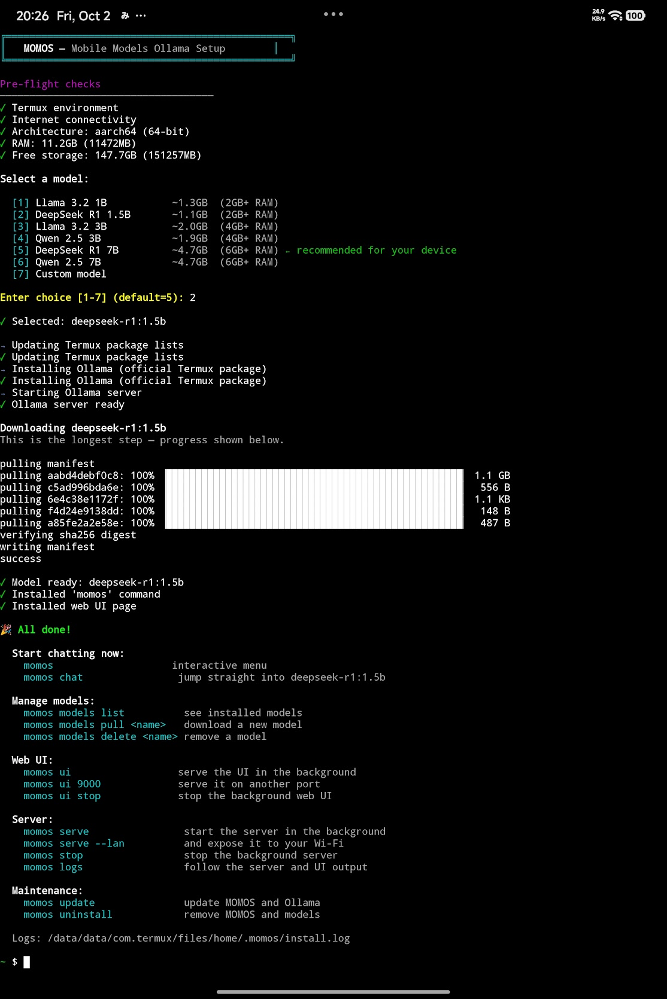
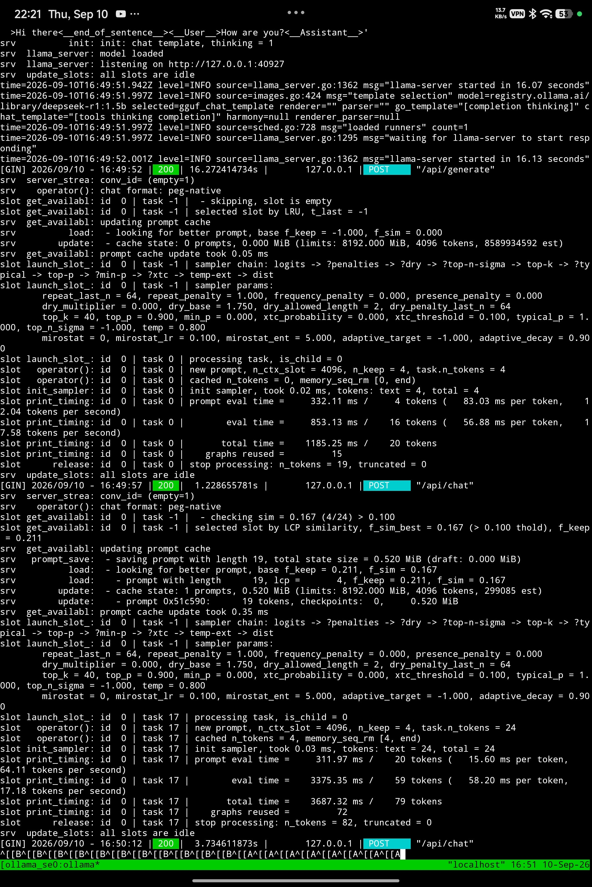

# MOMOS — Mobile Models Ollama Setup

[](LICENSE)
[](https://termux.dev)
[](#how-it-works)
[](#requirements)
[](#how-it-works)

Run lightweight AI models locally on your Android phone using Termux and Ollama. One command to install, no root needed, runs completely offline.

Nothing leaves your phone unless you ask it to. The model server listens on the phone itself; `momos serve --lan` is the one command that opens it to your Wi-Fi.



## What it does

- Checks your phone's RAM and storage
- Sets up a Debian container in Termux via PRoot (no root needed)
- Installs Ollama and downloads a model tailored to your device
- Adds a simple `momos` command to chat and manage models

---

## Quick Install

Open **[Termux](https://f-droid.org/packages/com.termux/)** and run:

```bash
bash -c "$(curl -fsSL https://raw.githubusercontent.com/Sidharth-e/MOMOS/main/scripts/momos.sh)"
```

The installer will test your hardware, recommend a model, set up the environment, and drop you straight into chat.

---

## Supported Models (<7B)

Larger models (14B, 32B) require too much memory and quickly crash or throttle on phones. MOMOS focuses on models under 7B parameters that fit within typical smartphone RAM limits (2GB to 8GB+):

| Model | Tag | Download | RAM Needed | Best For |
|---|---|---|---|---|
| **Llama 3.2 1B** | `llama3.2:1b` | ~1.3 GB | 2 GB+ | Fast responses, low battery use, low-end phones |
| **DeepSeek R1 1.5B** | `deepseek-r1:1.5b` | ~1.1 GB | 2 GB+ | Step-by-step reasoning and logic |
| **Llama 3.2 3B** | `llama3.2:3b` | ~2.0 GB | 4 GB+ | Everyday chat, writing, and summarization |
| **Qwen 2.5 3B** | `qwen2.5:3b` | ~1.9 GB | 4 GB+ | Math, coding, and multilingual queries |
| **DeepSeek R1 7B** | `deepseek-r1:7b` | ~4.7 GB | 6–8 GB+ | Advanced reasoning on higher-RAM devices |
| **Qwen 2.5 7B** | `qwen2.5:7b` | ~4.7 GB | 6–8 GB+ | Detailed coding and technical answers |

You can also use any model tag from the [Ollama library](https://ollama.com/library) (e.g. `phi4-mini`, `smollm2:1.7b`).

---

## Usage

### Interactive Menu
```bash
momos
```
Shows a numbered menu to chat, browse models, pull new models, or update.

### Chat
```bash
momos chat                       # Chat with your last used model
momos chat llama3.2:1b           # Chat with Llama 3.2 1B
momos chat deepseek-r1:1.5b     # Chat with DeepSeek R1 1.5B
momos chat qwen2.5:3b            # Chat with Qwen 2.5 3B
```

### Manage Models
```bash
momos models list                # Show downloaded models
momos models pull qwen2.5:3b     # Download a model
momos models delete llama3.2:3b  # Remove a model
```

### Server Logs
```bash
momos logs                       # Follow the server and web UI output (Ctrl+C to exit)
```



> [!NOTE]
> The Ollama server starts automatically in the background when running `momos chat` or managing models, and it starts **on the phone only**. You only need `momos logs` if you want to inspect server output directly.

```bash
momos serve                      # Start the server in the background, on the phone only
momos serve --lan                # Start it exposed to your Wi-Fi
momos stop                       # Stop the background server
```

Both `momos serve` and `momos ui` hand the terminal straight back and keep
running. Their output goes to `~/.momos/server.log` and `~/.momos/ui.log`, which
`momos logs` follows together — `tail` labels each line with the file it came
from, so the two are never mixed up.

> [!TIP]
> A backgrounded server stops when Android puts Termux to sleep. Run
> `termux-wake-lock` first if you are leaving the phone alone — see
> [Keeping Termux alive in background](#keeping-termux-alive-in-background).

`momos chat` and `momos models` start the server for you on `127.0.0.1` and leave it running. That is deliberately private: nothing on your network can reach it. `momos serve --lan` is the only way to change that.

### Chat from another device

```bash
momos serve --lan
```

This rebinds Ollama to all interfaces and tells it which browser origins to accept, then prints the addresses:

```
  Ollama:            http://192.168.1.42:11434
  OpenAI-compatible: http://192.168.1.42:11434/v1
                     (any non-empty key; the server ignores it)
```

It returns to the prompt once the server answers, so `momos ui` can be started
from the same session afterwards, and the phone and anything else on your Wi-Fi
can both chat with the same model.

The command only reports success after it has confirmed the server is really
reachable on the phone's Wi-Fi address. A `127.0.0.1` server looks identical to
an exposed one from inside the phone, so a bind that quietly failed would
otherwise be announced as exposure.

**OpenAI-compatible API**

`http://<phone-ip>:11434/v1` is a drop-in OpenAI base URL, so existing SDKs and tools work unchanged:

```bash
curl http://192.168.1.42:11434/v1/chat/completions \
  -H "Content-Type: application/json" \
  -d '{"model":"llama3.2:3b","messages":[{"role":"user","content":"hi"}]}'
```

Some clients insist on an API key. Ollama requires a non-empty one and then ignores it, so any string will do — `ollama` is the conventional choice.

> [!WARNING]
> **There is no authentication.** Anyone on your Wi-Fi who has the address gets the whole API, not just chat — they can list, pull and **delete** your models. The origin check stops other *websites* from reaching your phone; it does nothing about `curl`. Use `--lan` only on a network you trust, and run `momos stop` when you are done.

> [!NOTE]
> Exposure is not remembered. A server started later by `momos chat` or `momos models` comes back private, and so does one after a reboot — re-run `momos serve --lan`. If you run it while a private server is already up, it says so rather than appearing to succeed: the bind only changes on a restart, so it tells you to `momos stop` first.

> [!TIP]
> If you only want to chat from a browser, you do not need `--lan` on the phone that is serving the page. See below.

### Web UI

```bash
momos ui                         # Serve on port 8080
momos ui 9000                    # Serve on a different port
momos ui stop                    # Stop the background web server
```

The UI is served to your Wi-Fi, so you can open it from a laptop at the network
address it prints:

```
MOMOS UI — running in the background

  Phone:   http://localhost:8080
  Network: http://192.168.1.42:8080   <- open this on your laptop
```

The page is a chat interface. It talks to whichever model you used last — run `momos chat <model>` once if it tells you no model is chosen. The conversation lives in memory only, so reloading clears it.

Opened **on the phone**, it reaches Ollama over loopback and needs nothing else. Opened **from a laptop**, it needs `momos serve --lan` running too.

Running `momos ui` again while it is already serving reports the running one
rather than starting a second. `momos stop` does not stop it — the web server
has its own lifecycle, and `momos ui stop` is what ends it.

> [!WARNING]
> The port has no authentication — anyone on your Wi-Fi who has the address can
> open the page. Stop it with `momos ui stop` when you are done.

> [!IMPORTANT]
> Both the page and the `--lan` flag ship with the installer, so an existing
> install picks them up from `momos update`. Running `momos ui` alone on an
> install that predates them will serve the old placeholder page, and
> `momos serve --lan` will ignore the flag. Update first.

`momos ui` uses [darkhttpd](https://github.com/emikulic/darkhttpd) (about 1MB),
installing it on first use. If darkhttpd is unavailable it falls back to
`python3 -m http.server` instead.

### Update & Uninstall
```bash
momos update                     # Update MOMOS scripts and Ollama
momos uninstall                  # Remove Debian container and all models
momos help                       # Show all commands
```

---

## Requirements

- **Android 7.0+**
- **Termux** (install from [F-Droid](https://f-droid.org/packages/com.termux/) or [GitHub](https://github.com/termux/termux-app/releases), avoid Play Store builds)
- **RAM**: 2GB minimum (4GB+ recommended for 3B models, 8GB+ for 7B models)
- **Free Storage**: 3GB to 6GB+ depending on chosen model
- **No root required**

---

## New to Termux?

If you just installed Termux, run this setup script first to update packages and grant storage permissions:

```bash
bash -c "$(curl -fsSL https://raw.githubusercontent.com/Sidharth-e/MOMOS/main/scripts/setup.sh)"
```

<details>
<summary>Manual setup commands</summary>

```bash
pkg update && pkg upgrade -y
pkg install curl -y
termux-setup-storage
```
Then run the Quick Install command above.
</details>

---

## How It Works

```
┌─────────────────────────────────────────┐
│  Termux (Android)                       │
│  ┌───────────────────────────────────┐  │
│  │  Debian (via PRoot — no root)     │  │
│  │  ┌─────────────────────────────┐  │  │
│  │  │  Ollama Server (background) │  │  │
│  │  │  └─ Local Model (<7B)       │  │  │
│  │  └─────────────────────────────┘  │  │
│  └───────────────────────────────────┘  │
│  └─ 'momos' launcher command            │
└─────────────────────────────────────────┘
```

1. **PRoot**: Runs a Debian userland container without root permissions.
2. **Ollama**: Runs the model server inside the container.
3. **MOMOS launcher**: A bash script in `$PREFIX/bin/momos` that handles starting the server, attaching to chats, and managing models with simple arguments.

---

## Troubleshooting

### Installation fails
Check the log:
```bash
cat ~/.momos/install.log
```

### "Permission denied"
Run:
```bash
termux-setup-storage
```
Then run the installer again.

### Model runs slowly or Termux crashes (Killed / OOM)
The model is using more RAM than your device has available. Switch to a smaller model:
```bash
momos chat llama3.2:1b
# or
momos chat deepseek-r1:1.5b
```

### Keeping Termux alive in background
Run `termux-wake-lock` to keep Android from sleeping Termux during inference.

### The laptop can't reach the model

Two causes look identical from the browser, so check both.

**The server is private.** `momos chat` and `momos models` start Ollama on the phone only. Run:

```bash
momos serve --lan
```

If it reports that the server is already running but only on this phone, that is the answer — run `momos stop` and then `momos serve --lan` again. The bind only changes on a restart.

**The browser's origin is no longer allowed.** `--lan` pins the origin to the phone's address at the moment it starts. If the phone got a new address since (a fresh DHCP lease, or a different network), the page still loads but its requests are refused. Restart `momos serve --lan` to re-pin it.

### The web page says no model is chosen

It reads the last model you used. Pick one in Termux first:

```bash
momos chat llama3.2:1b
```

---

## License

MIT · [View License](LICENSE)
